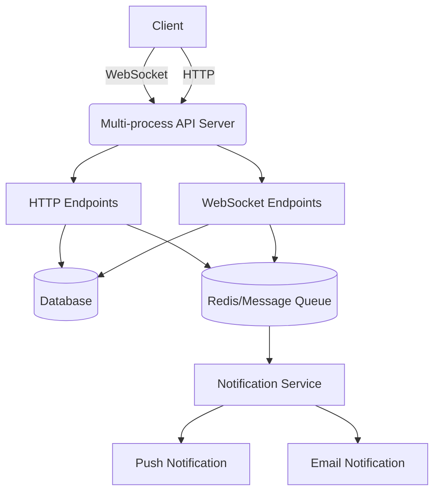

# 1. Architecture

```mermaid
graph TD
    A[Client] -->|WebSocket| C(Multi-process API Server)
    A -->|HTTP| C
    C --> D[HTTP Endpoints]
    C --> E[WebSocket Endpoints]
    D --> F[(Database)]
    D --> G[(Redis/Message Queue)]
    E --> G
    E --> F
    G --> I[Notification Service]
    I --> J[Push Notification]
    I --> K[Email Notification]
```
