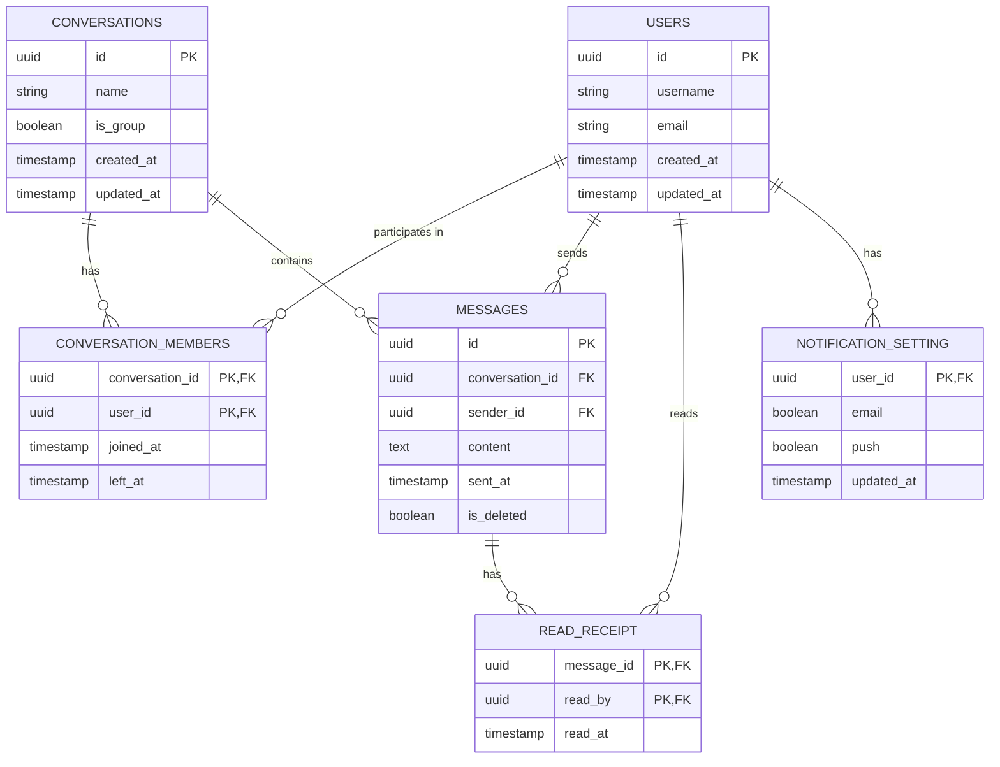

# Domain models

## ER Diagram

```mermaid
erDiagram
    USERS {
        uuid id PK
        string username
        string email
        timestamp created_at
        timestamp updated_at
    }
    CONVERSATIONS {
        uuid id PK
        string name
        boolean is_group
        timestamp created_at
        timestamp updated_at
    }
    CONVERSATION_MEMBERS {
        uuid conversation_id PK,FK
        uuid user_id PK,FK
        timestamp joined_at
        timestamp left_at
    }
    MESSAGES {
        uuid id PK
        uuid conversation_id FK
        uuid sender_id FK
        text content
        timestamp sent_at
        boolean is_deleted
    }
    READ_RECEIPT {
        uuid message_id PK,FK
        uuid read_by PK,FK
        timestamp read_at
    }
    NOTIFICATION_SETTING {
        uuid user_id PK,FK
        boolean email
        boolean push
        timestamp updated_at
    }

    USERS ||--o{ CONVERSATION_MEMBERS : "participates in"
    CONVERSATIONS ||--o{ CONVERSATION_MEMBERS : "has"
    CONVERSATIONS ||--o{ MESSAGES : "contains"
    USERS ||--o{ MESSAGES : "sends"
    MESSAGES ||--o{ READ_RECEIPT : "has"
    USERS ||--o{ READ_RECEIPT : "reads"
    USERS ||--o{ NOTIFICATION_SETTING : "has"
```
