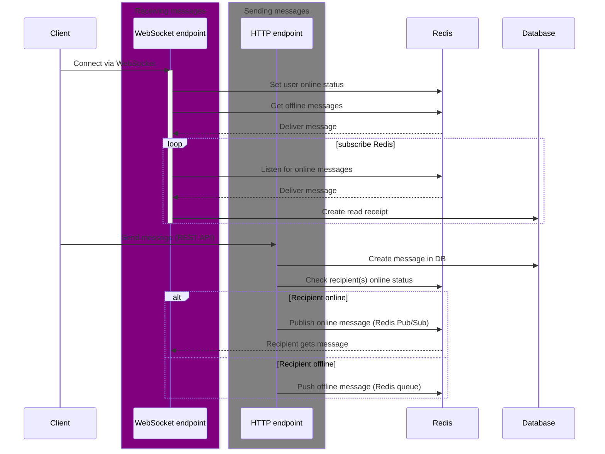
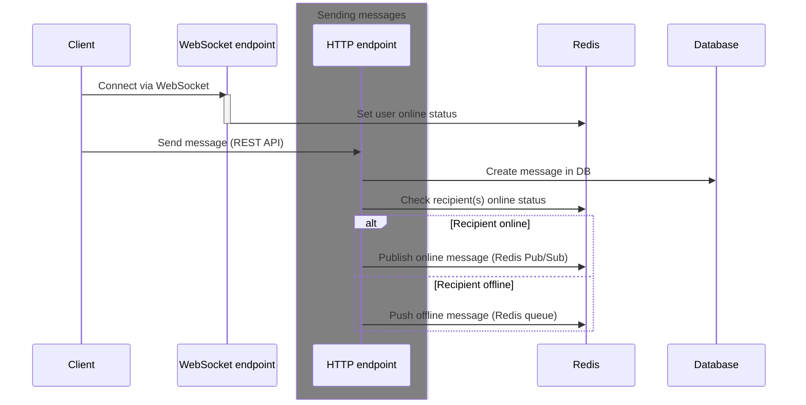
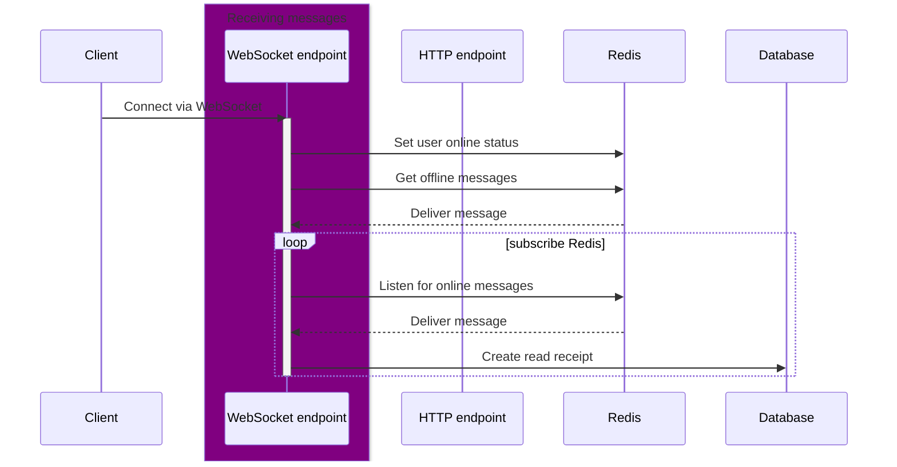

# 3. Use Cases

For horizontal scalability, we send the messages to Redis first.

## Overview

```mermaid
sequenceDiagram
    participant C as Client
    box Purple Receiving messages
    participant W as WebSocket endpoint
    end
    box Gray Sending messages
    participant A as HTTP endpoint
    end
    participant R as Redis
    participant D as Database

    C->>W: Connect via WebSocket
    activate W
    W->>R: Set user online status
    W->>R: Get offline messages
    R-->>W: Deliver message
    loop subscribe Redis
        W->>R: Listen for online messages
        R-->>W: Deliver message
        W->>D: Create read receipt
    end
    deactivate W


    C->>A: Send message (REST API)
    A->>D: Create message in DB

    A->>R: Check recipient(s) online status
    alt Recipient online
        A->>R: Publish online message (Redis Pub/Sub)
        R-->>W: Recipient gets message
    else Recipient offline
        A->>R: Push offline message (Redis queue)
    end
```

## Message sending

```mermaid
sequenceDiagram
    participant C as Client

    participant W as WebSocket endpoint

    box Gray Sending messages
    participant A as HTTP endpoint
    end
    participant R as Redis
    participant D as Database

    C->>W: Connect via WebSocket
    activate W
    W->>R: Set user online status
    deactivate W

    C->>A: Send message (REST API)
    A->>D: Create message in DB

    A->>R: Check recipient(s) online status
    alt Recipient online
        A->>R: Publish online message (Redis Pub/Sub)
    else Recipient offline
        A->>R: Push offline message (Redis queue)
    end
```

## Message receiving

```mermaid
sequenceDiagram
    participant C as Client

    box Purple Receiving messages
    participant W as WebSocket endpoint
    end

    participant A as HTTP endpoint
    participant R as Redis
    participant D as Database

    C->>W: Connect via WebSocket
    activate W
    W->>R: Set user online status
    W->>R: Get offline messages
    R-->>W: Deliver message
    loop subscribe Redis
        W->>R: Listen for online messages
        R-->>W: Deliver message
        W->>D: Create read receipt
    end
    deactivate W
```
